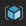
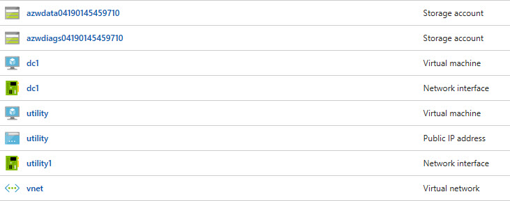
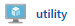
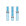

## Objective
You have just created a lab environment in Azure.  The lab environment is intended to mimic a basic, on-premises datacenter.  This datacenter, being extremely basic, consists of a single Active Directory domain controller and a utility machine.

The first objective is for you to become familiar with connecting to and navigating the Azure portal.  We will also explore the components in our virtual "datacenter" that the CLI created for us.  Finally, we will connect to our remote datacenter.

## Azure Portal Basics
Let's start by connecting to the Azure portal and becoming familiar with navigation.

  1. Open a browser and navigate to [http://www.azure.com](http://www.azure.com).

  2. In the top-right corner of your screen, you will see the menu option **PORTAL**. Click on it.
  
  3. If you have not already, you will be required to authenticate.
  
  4. After authentication is successful, you will be directed to your _Dashboard_. The dashboard is configurable by adding, removing and resizing _tiles_.  Additionally, you can have multiple dashboards depending on your preferences.  You could have different dashboards for resources dedicated to different functions, lines of business, or for operations.

  5. On the left will be your primary navigational menu. You should see a list of favorited services on the menu with descriptions.  (NOTE: The size of your menu may differ from that of others depending on the number of services you have selected as a favorite.) If all you see are icons (no descriptions) on your menu, your menu is currently collapsed.  Click the "hamburger"  to expand it. 

  6. Pretty close to the top of your menu, you should see **Resource Groups** . Click this option.

  7. Upon clicking the Resource Groups menu item, a _blade_ will open revealing your created resource groups. In this list, you should find the resource group that the CLI created for you.  It begins with **azworkshops_basicAD_**, followed by a datetime stamp. (NOTE: If you do not see this listed in your available resources groups, ensure that in the second dropdown box above, you have the correct subscription selected.  This should be the same subscription you chose earlier in the CLI.)

  8. Clicking on this resource group with expand another blade listing all of the resources created by the CLI.  What you should see listed are two storage accounts, two virtual machines, two network interface cards, one public IP address and one virtual network.  (NOTE: The datetime stamps for your storage accounts will be different.)

#### Resource Descriptions
As stated in the previous step and indicated by the preceeding screen clipping, the CLI created 8 different resources in this group for the workshop.  Let's explore these is a little bit more detail.

The first two items listed are storage accounts - one for the virtual machine disk drives and another to store diagnostic logs from the VMs. Storage accounts must be globally unique across Azure.  Therefore, we've appended datetime stamps to the end of our storage account names in order to prevent collision.

Next, you will see two virtual machines - **dc1** and **utility** - listed.  **dc1** is our Active Directory's domain controller. Each machine requires a network interface card for connectivity.  Additionally, the **utility** VM has a public IP assigned to it. Exposing our domain controller via a public IP is a very bad practice.  Therefore, we will remotely connect to our virtual network via our **utility** VM.  All machines in Azure, by default, have connectivity _out_ to the Internet.  But, only VMs that have public IPs can be accessed from the Internet (e.g. outside of the network).

Finally, our VMs are connected to each other by utilizing a virtual network. With the exception of storage and a few other resources in Azure, a virtual network is required.

#### Viewing Resource Details
Let's take a moment and view some of the information about the VMs that were created for us.  Let's use the **utility** VM as our example.

  1. Find the **utility** VM  and click on it.  This will expand another blade with our details for the virtual machine.

  2. In the **Overview** pane, you'll immediately see three sections:

      1. Actions - allows you to perform various actions on the virtual machine (e.g. connect, start, stop, etc.)

      2. Information - displays various information about your virtual machine (e.g. resource group, location, status, IP address, etc.)

      3. Metrics - reports various performance metrics regarding your virtual machine (e.g. CPU, network, etc.)

  3. Now, let's look at one more page for some additional details. In the left pane (still on the **utility** blade), approximately half-way down, click on **Properties** .  On this blade, you will find additional information like the private IP address and specific resource ID.  While there are other places to find this information, this provides a quick-access method.

## Connecting to the Network
We will now remotely connect to our virtual network.  Remember, exposing our domain controllers via a public IP is unsafe and not recommended.  We've, therefore, created a **utility** virtual machine - sometimes known as a _bastion_ server - that will allow us an entrypoint into our network.

  1. Make sure you have the **utility** VM selected and click on **Overview** .

  2. In the _Actions_ section, click **Connect** . This will download a Remote Desktop (Protocol) profile to your machine.

  3. Open the RDP profile. (NOTE: You may receive a warning that "The publisher of this remote connection can't be identified." Proceed by clicking on **Connect**.)

  4. Windows security will prompt you to enter your credentials. Enter the full AD credentials that was reported to you earlier by the CLI (e.g. azurecloud\cloudadmin). Additionally, enter your password. Click **OK**.

  5. If the credentials were entered successfully, you should be remotely connected to the **utility** VM.

  6. (Optional) If you'd like, once you are connected to the **utility** VM, you can connect remotely to the Active Directory domain controller ("**dc1**") in the virtual network.  Simply open up Remote Desktop _in the active, remote session_ and use the internal, private IP (e.g. 10.3.1.4) as the address.  Use the same credentials to connect to the domain controller as you did with the **utility** virtual machine.

This completes our simple introduction into navigating through Azure. We'll go into more detail as we work through the rest of the workshop, but this is enough to get us started.