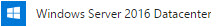
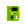
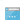
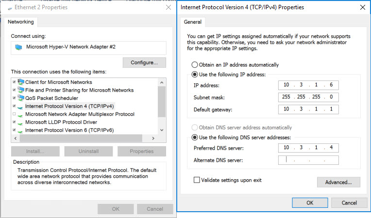

## Objective
We could use our domain controller for the AD Connect synchronization server, but this is a bad idea.  There's typically multiple (primary, secondar, maybe more) domain controllers in an Active Directory environment. We are only allowed to have one active/hot AD Connect synchronization server in our environment.  What happens if the domain controller where the the synchronization tool is installed fails?  We would lose synchronization capabilities.

Let's create a standalone AD Connect synchronization server.

## Create the Server in Azure
If you are not currently at dashboard within the Azure portal, go ahead and close all blades.

On the left menu, you should see **Virtual machines** . Click it.

  1. In the actions section of the virtual machines blade, click on .

  2. In the _Search Compute_ search box, type in **Windows Server 2016 Datacenter**. Press Enter.

  3. In the returned results, choose the option that simply reads . 
  
  4. In the next blade, make sure **Resource Manager** is selected. Then, click _Create_.

  5. There are 4 sections to configure the virtual machine.

      1. Basics

          * Name: **ad-connect**
          * VM disk type: **SSD**
          * Username: **cloudadmin**
          * Password: **Pass@word1234**
          * Confirm Password: _&lt;same as above&gt;_
          * Subscription: **Free Trial**
          * Resource Group: **Use existing** - _&lt;use the same resource group created by the CLI&gt;_
          * Location:  _&lt;use the same location you chose in the CLI&gt;_
          * Save money: **No**

      2. Size

          * **DS1_V2**

      3. Settings

          * Use managed disks: **No**
          * Storage account: _&lt;use the same storage account created by the CLI&gt;_ (e.g. _azwdata####_)
          * Network: **vnet**
          * Subnet: **default (10.3.1.0/24)**
          * Public IP address: (click on it & _Create new_)
              * Name: **connect-ip**
              * Assignment: **Static**
          * Network security group (firewall): **None**
          * Extensions: **None**
          * Availability set: **None**
          * Boot diagnostics: **Enabled**
          * Guest OS diagnostics: **Disabled**
          * Diagnostics storage account: _&lt;use the same storage account created by the CLI&gt;_ (e.g. _azwdiags####_)

      4. Summary (just click _OK_ to continue)

The machine we chose for this workshop is relatively small.  After all, we only have 4 identities that we'll be synchronizing with Azure AD.  If this was a production environment we would have to take into consideration that password sync's occur approximately every 2 minutes while full synchronization happens every 15-30 minutes.  For production, we would need to choose a machine that is more capable of handling the workload.

Keep in mind, that we are treating Azure like our on-premises datacenter.  In reality, we would have simply created a new VM in our on-premises hypervisor (Hyper-V, VMware, etc.)

## Add Machine to Domain
We need to add the new machine to our Active Directory domain.  AD Connect must be installed on an AD-joined machine.  

#### Set the Private IP as Static
Before we add the machine to the domain, we need to set the private IP to static so that Azure's DHCP server doesn't reassign the IP to another machine.

  1. If you are not viewing the details on the newly created machine, click on the **Virtual machines**  menu item, then click on the **ad-connect** machine in the list.

  2. Once you've clicked on the **ad-connect** machine and are viewing the machine's _Overview_ blade, choose **Network interfaces** .

  3. In the resulting list of network interfaces, choose the single NIC that is listed (e.g. _ad-connectXXX_).

  4. On the network interface menu, click on **IP configurations** .

  5. The resulting list should only contain a single configuration - _ipconfig1_. You'll notice that under the heading _PRIVATE IP ADDRESS_, the configuration is listed as _Dynamic_. Click on this configuration.

  6. In the settings for the configuration, under _Private IP address settings_, change the _Assignment_ to **Static**. (The IP address should be 10.3.1.6.  If it is not, update it, as well.)

  7. Click _Save_.

You can now close the two blades (e.g. ad-connectXXX, network interface) to arrive at the main **Network interfaces**  blade for the **ad-connect** virtual machine.

#### Connect to the Machine via Remote Desktop
To connect to the machine remotely, we need to download the Remote Desktop Protocol (RDP) profile.

  1. Click on the **Overview**  to return to the general information for the **ad-connect** virtual machine.

  2. In the **Actions** section, click on **Connect** . This will download the RDP profile to your machine. 

  3. Open the profile and accept any warnings.

  4. For the username, enter **\cloudadmin** (with the backslash). And, for the password, enter **Pass@word1234**. Click _OK_.

  5. Again, accept any warnings.

#### Add the Machine to the Domain
When you initially connect to the machine, you will see the _Server Manager_ dashboard.

We've already set the IP on the network interface card (NIC) to be static in Azure.  Technically speaking, we've created a _reservation_ in Azure's DHCP server for the NIC in our virtual network. However, before we add the machine to the domain, it is best if we set the IP as static within Windows Server's TCP/IP configuration.

  1. In the left menu of _Server Manager_, click on **Local Server**.

  2. In the resulting page, you'll see a couple of sections. The first section is labeled _Properties_.  _Properties_ has two columns.  Half-way down the left column, you'll see _Ethernet_ followed by a number.  Beside this, you will see in blue **IPv4 address assigned by DHCP, IPv6 enabled**. Click on this.

  3. This will open the _Network Connections_ window. Right-click on the single listed adapter and click on **Properties** in the context menu.

  4. In the _Properties_ window for the NIC, scroll down until you see _Internet Protocol Version 4 (TCP/IPv4)_. Highlight it, then click _Properties_.

  5. Enter the values as you see them below. 

  6. Click _OK_, the _Close_. **NOTE:** Clicking _Close_ will cause a brief interruption in your connectivity. That's okay.  The connection should be re-established within a couple of seconds.

  7. Once the connection has been re-established, you can close the _Network Connections_ window.

  8. Back in the _Properties_ section, in the half-way down the right column, you will see _IE Enhanced Security Configuration_. To the right of that in blue, you probably see **On**. Click on it.

  9. In the _Internet Explorer Enhanced Security Configuration_ dialog, choose **Off** for both, Administrators and Users. Then, click _OK_.
  
  10. Once more, in the _Properties_ section, the second item listed in the left column reads _Workgroup_. To the right of that, you will see in blue **WORKGROUP**. Click on it.

  11. In the _System Properties_ dialog, half-way down, click on the _Change_ button.

  12. In the resulting _Computer Name/Domain Changes_ dialog:

      1. Leave the _Computer name_ as it is (e.g. _ad-connect_).
      2. Under _Member of_, change the selection to _Domain_ and enter the domain name you entered earlier in the CLI (e.g. mycompany.local).
      3. Click _OK_.
      4. For the username and password enter your _Domain Admin_ username and _Domain Admin Password_, respectively, as reported previously by the CLI.
      5. Click _OK_.

If all goes well, you should be added to the virtual datacenter domain and receive a message stating as much. To complete this will require a reboot, thus disconnecting you from your remote session.