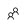
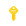
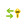

## Objective
We are now finally ready to begin the configuration of our synchronization process.  Upon completion of this step, your virtual datacenter will be sync'ing with Azure AD.

## Install Azure AD Connect
To have our local domain synchronize with Azure AD we need Azure AD Connect.  We will install it on the **ad-connect** virtual machine.

  1. As you have previously connected to the **ad-connect** and **utility** VMs already, let's RDP to the **ad-connect** machine once more.

  2. Once you've successfully connect to **ad-connect**, you will need to download and install the Azure AD Connect tool.  You can download it from [https://www.microsoft.com/en-us/download/details.aspx?id=47594](https://www.microsoft.com/en-us/download/details.aspx?id=47594).

  3. Upon installing Azure AD Connect, it will automatically run.

  4. Check the box agreeing to the license terms and click **Continue**.

  5. For the moment, **Express Settings** are sufficient.  We'll customize it later.  So, go ahead and click **Use express settings**.

  6. Once the basic initialization has completed, you will be asked for your Azure AD credentials.  Enter the credentials you use for authenticating against Azure for your trial subscription (e.g. _&lt;yourusername&gt;@&lt;yourcompany&gt;.onmicrosoft.com_). Click **Next**.

  7. For connecting to AD DS, use the _cloudadmin_ credentials provided to you by the CLI (you've also used these credentials for connecting remotely into the VMs).

  8. The next screen confirms mapping between the local UPN and a _verified_ domain in Azure AD.  Since we don't have a verified domain in Azure - we're just using the default *.onmicrosoft.com - all local accounts will be "re-mapped" to the onmicrosoft.com domain.  For our workshop, we can simply check the box next to **Continue without any verified domains** and click **Next**.

  9. **BEFORE YOU CLICK Install**, _uncheck_ the box next to **Start the synchronization process when configuration completes**.  Otherwise, _all_ accounts (including system accounts) will be synchronized creating a lot of bloat in our Azure AD.  We're going to create some filters before we conduct our first sync.

  10. Now, you're ready to complete the install for Azure AD Connect. Click **Install**.

After a few minutes, you should receive confirmation that the configuration has completed.  It may also give you a couple of house-keeping recommendations.  Go ahead and click **Exit** to exit the installer.

## Configure Synchronization Filters
We need to create some filters to _only_ synchronize our users who's UPNs have been updated to the "new" domain.

In order to do this, we need to create what's called a "Positive Filter." Basically, we're instructing AD Connect to "only sync these."  Keep in mind that, by default AD Connect will sync _all_ users in our domain (or OU, depending how we have configured the sync scope). So, in order to create a positive filter, we need to create two rules - one that specifies which users to sync; and, another that instructs AD Connect to _not_ sync all of the remaining users.

Both of our rules are considered _Incoming Sync Rules (ISR)_ because they are determining what data we are allowing _into_ the metaverse from our local Active Directory.

First, let's begin by opening up the synchronization rules. In the **Start Menu** of the **ad-connect** VM, click on **Sychronization Rules Editor**. You'll see approximately 15-20 default rules.  We're going to add our two rules to the top in order for our rules to take precedence.

#### Users Match Filter
This filter will instruct which users we _do_ want to sync with Azure AD.

  1. In the _Synchronization Rules Editor_ click on **Add new rule**.

  2. **Description**:

      1. Name: **UPN Demo - Users Match Filter**
      2. Description: **Only sync users who match our onmicrosoft.com UPN**
      3. Connected System: **choose your _.local_ domain**
      4. CS Object Type: **user**
      5. Metaverse Object Type: **person**
      6. Link Type: **Join**
      7. Precedence: **50**
      8. Enable Password Sync: **check**

  3. **Scoping filter**:

      1. Click **Add group**
      2. Click **Add clause**
      3. In the clause, enter the following values for each column, respectively:
          * Attribute: **userPrincipalName**
          * Operator: **ENDSWITH**
          * Value: **_&lt;yourcompany&gt;_.onmicrosoft.com**

  4. **Join rules**: leave blank

  5. **Transformations**:

      1. Click **Add transformation**
      2. In the transformation, enter the following values for each column, respectively:
          * FlowType: **Constant**
          * Target Attribute: **cloudFiltered**
          * Source: **False**

  6. Click **Save**.

#### Users Catch-All Filter
This filter will instruct which users we _do not_ want to sync with Azure AD.

  1. In the _Synchronization Rules Editor_ click on **Add new rule**.

  2. **Description**:

      1. Name: **UPN Demo - Users Catch-All Filter**
      2. Description: **Catch and filter out all other users who do not have the onmicrosoft.com domain.**
      3. Connected System: **choose your _.local_ domain**
      4. CS Object Type: **user**
      5. Metaverse Object Type: **person**
      6. Link Type: **Join**
      7. Precedence: **99**

  3. **Scoping filter**: leave blank
  4. **Join rules**: leave blank

  5. **Transformations**:

      1. Click **Add transformation**
      2. In the transformation, enter the following values for each column, respectively:
          * FlowType: **Constant**
          * Target Attribute: **cloudFiltered**
          * Source: **True**

  6. Click **Save**.

Before you close the _Syncrhonization Rules Editor_, notice that at the bottom of the window, you are able export rules to a PowerShell script. For any custom rules, this should be part of your disaster recovery plan in case the AD Connect synchronization server fails.  You may now close the editor.

## Enable Password Writeback
One last thing we want to do is configure the Azure AD Connect tool to writeback password changes to our local Active Directory.  Additionally, remember that, during installation, we elected to not start the synchronization service.  So, we going to do that, as well.

  1. On the desktop of your **ad-connect** VM, you should see a new icon for **Azure AD Connect**. Go ahead and open the tool.

  2. Immediately, you'll notice that while the connect tool is open, the service is suspended.

  3. Click **Configure**.

  4. Select **Customize synchronization options** and click **Next**.

  5. Type in your credentials for Azure and click **Next**.

  6. Type in your credentials for the local Active Directory and click **Next**.

  7. In the **Domain and OU Filtering**, we only want to sync our **Users** group. This will keep Azure AD nice and tidy. So:
      
      1. Select **Sync selected domains and OUs**.
      2. Expand the local domain and uncheck all OUs _except_ **Users**.
      3. Click **Next**.

  8. Check _both_ **Password synchronization** and **Password writeback**. Click **Next**.

  9. **BEFORE YOU CLICK Configure**, _check_ the box next to **Start the synchronization process when configuration completes**.  This time, we want the synchronization service to begin sync'ing our users.

  10. Click **Configure**.

  11. Once the configuration has completed, you should receive a confirmation. Click **Exit**.

## Confirming a Successful Synchronization
Give the synchronization service a minute to "spin up" and conduct its first sync. Then, let's head over to our Azure portal to confirm that the synchronization was successful.  Once you've reached your Azure portal, perform the following steps.

  1. On the left menu, click on **Azure Active Directory** .

  2. In the _Azure Active Directory_ blade, click on **Users and groups** .

  3. In the _Users and groups_ blade, click on **All users** .

We should now see all 3 users from our local Active Directory listed here. Question... If our Azure AD grows to a huge list of users, how will we know which users originated in the cloud and which ones are sync'ed from our on-premises Active Directory?

While we are still on the same blade (viewing our users list), do the following:

  1. In the _Actions_ section, click on **Columns** .

  2. Check the box next to **Source of authority**.

  3. Click **Apply**.

We now see from where our users are originating, whether that on-premises (e.g. Windows Server AD) or the cloud (e.g. Azure Active Directory).

Remember that any changes made to synchronized users (e.g. Windows Server AD) are replicated back down to our local Active Directory.  However cloud users are _not_ synchronized.

## Completing Password Writeback
In completing the Azure AD Connect configuration, we enabled password writeback. But, by default, users aren't able to update their passwords in Azure.  We need to enable users to have the ability to update their passwords.

  1. While you are still on the _Users and groups_ blade, click on **Password reset** .

  2. You will see here that self-service password is not enabled for anyone.  Click on **All** and then click **Save**.

  3. Finally, let's confirm that password writebacks are enabled in Azure. Click on **On-premises integration** .

  4. From here, you will see that password writebacks are, indeed, enabled along with restricting users from unlocking their accounts without resetting their passwords.

You now have our local Active Directory sync'ing with our Azure AD.  

## Additional Notes
Interestingly enough, if you log out of Azure and attempt to login with one of the UPNs that was sync'ed (for example, **jim.smith@_&lt;yourcompany&gt;_.onmicrosoft.com** with the default password **Pass@word1234**), Azure will require you to set up a secondary authentication method - phone or email - prior to being able to login.

Also, if you login to your Office 365 trial tenant, you'll see the users from your on-premises Active Directory listed.  All you would need to do at this point is assign them licenses.